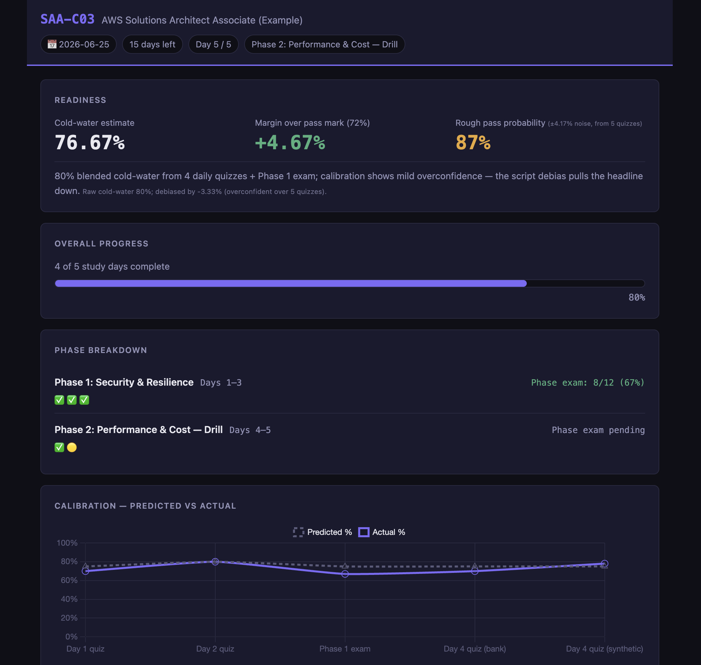

# Learning Coach

Most people study for certifications the same way: watch a course, take notes, do a practice test the week before, and hope for the best. There's no real feedback loop. No honest signal on whether the hours are actually moving the needle. No one to ask when something doesn't click at 11pm.

This is a personal study coach that builds a structured plan around your exam, teaches the material, quizzes you, and tells you - with a number, not a feeling - whether you're ready to pass. 

**When you don't understand something, you ask in plain English.** It explains, re-explains from a different angle, and has unlimited time to do it. Between sessions it remembers where you left off. Over time it tracks which concepts you keep getting wrong and makes sure they get drilled before exam day.

**It works even if your exam doesn't have a well-defined curriculum.** Bring whatever materials you have - official guides, course notes, community cheatsheets - and it builds the curriculum from them. Bring nothing at all, and it works from its own knowledge. 
No exam at the end? That's fine too - it's a tutor, not just an exam-prep tool.

Built primarily for certification exams (AWS, Azure, GCP, and similar), but usable for any structured knowledge domain Claude has knowledge of.

---

**Contents**
- [See it in action](#see-it-in-action)
- [Quick Start](#quick-start)
- [What you bring / What it does](#what-you-bring--what-it-does)
- [Day-to-day use](#day-to-day-use)
- [Dashboard](#dashboard)
- [How the coach works](#how-the-coach-works)
- [Setup interview](#setup-interview-init-coach)
- [Repo layout](#repo-layout)
- [Docs](#docs)
- [⚡ Advanced: Semantic Retrieval](#-advanced-semantic-retrieval-optional)
- [How to read the dashboard](#how-to-read-the-dashboard)
- [License](#license)

---



---

## See it in action

A fully-populated example lives at [`courses/example-saa-c03/`](courses/example-saa-c03/). Open `courses/example-saa-c03/dashboard/index.html` in any browser to see a mid-prep dashboard: debiased readiness estimate, calibration chart, watchlist, domain coverage vs blueprint, and more. The student "Alex" is synthetic - it's a fixture, not a real prep run.

---

## Quick Start

```bash
git clone https://github.com/cripkd/claude-learning-coach my-exam-prep
cd my-exam-prep
npm install     # one-time: installs ajv for schema validation
claude          # opens Claude Code
```

Requires Node.js ≥ 18.

Then in the Claude Code prompt:

```
/init-coach          # guided setup - ~10 questions, ~5 minutes
                     # drop your source materials into courses/{slug}/sources/
                     # (optional: drop real practice questions into courses/{slug}/bank/)
/index-sources       # builds a topic → file:line map so the coach reads only what's relevant
"run diagnostic"     # pre-study assessment; rebalances the phase plan
"let's go"           # start Day 1
```

Subsequent sessions: just open Claude Code and say `"let's go"` or `"Day N"`. Re-run `/index-sources` any time you add files to `sources/`.

---

## What you bring / What it does

**You bring:**
- Source materials (official guide, course notes, docs) as markdown or plain text in `sources/`
- Priority tiers: primary / secondary / tertiary, declared in `SOURCES.md`
- Your background, learning style, and exam date (captured during `/init-coach`)
- Optionally: real practice questions in `bank/`

**It does:**
- Per-day session structure: concepts → exam traps → decision rules → practice questions
- Domain-weighted phase plan, front-loaded to your weakest areas after the diagnostic
- Quizzes with full explanation of all options - bank questions weighted 2× synthetic in readiness math
- Tracks misses and auto-promotes recurring traps to a Repeat-Miss Watchlist
- Calibrates your confidence: predicted vs actual per quiz, debiased once you have ≥ 5 data points
- Rebuilds a visual progress dashboard automatically on every state change
- Final-72-hour playbook (see [`docs/ENDGAME.md`](docs/ENDGAME.md))

---

## Day-to-day use

```bash
claude          # open Claude Code in the project directory
```

Then: `"let's go"` or `"continue"` or `"Day 7"`. The dispatcher loads your active course, reads the session log and progress file, and picks up where you left off. Multiple days per session is fine - if you're in flow, keep going.

The dashboard rebuilds automatically whenever the state changes. Refresh the tab after each session.

---

## Dashboard

Open in any browser:

```bash
open courses/{your-course}/dashboard/index.html   # macOS
```

Shows:
- Header: exam name, days remaining, current day and phase
- Readiness: cold-water estimate, margin over pass mark, rough pass probability
- Phase breakdown with day-status pills and phase exam scores
- Calibration chart: predicted vs actual over time
- Domain coverage weighted by exam blueprint
- Coverage vs blueprint: flags under-drilled high-weight domains
- Recent quiz scores, Repeat-Miss Watchlist, recent misses
- Source priority strip

See [`docs/DASHBOARD.md`](docs/DASHBOARD.md) for internals and pass-probability framing, or [How to read the dashboard](#how-to-read-the-dashboard) below for a plain-English glossary of every metric.

---

## How the coach works

A few design choices that make this different from a study tracker:

- **Separate rules vs traps files** - `cheatsheet.md` holds forward-looking decision rules; `misses.md` holds retrospective trap patterns. Different mental modes; mixing them dilutes both.
- **Repeat-Miss Watchlist** - miss the same trap twice and it's auto-promoted to the highest-priority drill surface. No manual curation.
- **Honest calibration** - numeric estimates from your own history, not vibes. The coach debiases its readiness estimate from your predicted-vs-actual record once there are ≥ 5 calibration points.
- **Source-aware answers** - primary > secondary > tertiary. When sources disagree the coach follows the declared hierarchy; when all sources are silent it says so rather than guessing.
- **Source-grounding gate** - a `Stop` hook refuses to end the turn if the coach claims to deliver Day N without having read the cited source ranges in the current session. "Read sources before teaching" is a runtime invariant, not a rule. See [`docs/DESIGN.md`](docs/DESIGN.md) § 10.

Full design rationale and rejected alternatives: [`docs/DESIGN.md`](docs/DESIGN.md).

---

## Setup interview (`/init-coach`)

A guided interview - no manual file editing. You'll be asked:

1. **Exam name** - full name + short abbreviation (e.g., `"AWS Solutions Architect Associate (SAA-C03)"`)
2. **Exam date** - `YYYY-MM-DD`, or `"ongoing"` if not date-bound
3. **Your name** - optional; used in tone
4. **Your background** - role, prior experience, known gaps (1–3 sentences)
5. **How you learn best** - scenarios/hands-on, lecture-style, drilling, or mixed
6. **Exam domains** - with weights if known (`"D1: 30%, D2: 22%"`), without (equal split), or `"no blueprint"`
7. **Scenario vs recall** - integrated case reasoning or primarily recall? Affects phase plan shape.
8. **Scoring & question format** - fixed-percent / scaled / pass-fail-unknown; 4 or 5 options; single- or multiple-correct. Skip with `"default"`. Full spec: [`docs/EXAM-PROFILES.md`](docs/EXAM-PROFILES.md).
9. **Total study days**
10. **Source materials** - paths to drop in, or `"I'll add them later"`
11. **Question bank** - real practice questions for `bank/`, or `"no"`. See [`docs/SETUP.md`](docs/SETUP.md#adding-a-question-bank-optional).
12. **Reference resources** - courses, docs, community links (optional)

After the interview, the coach generates your `CLAUDE.md`, copies and fills all starter files, writes `data/state.json`, and renders the first `dashboard/index.html`.

---

## Repo layout

Each course lives in its own folder under `courses/`. Multiple courses can run in parallel with clean separation.

```
courses/
└── saa-c03/               ← one folder per course
    ├── CLAUDE.md           ← course-specific coach (generated by /init-coach)
    ├── memory.md           ← session log
    ├── progress.md         ← phase/day tracker
    ├── cheatsheet.md       ← forward-looking decision rules
    ├── misses.md           ← trap index + Repeat-Miss Watchlist
    ├── cases.md            ← case patterns
    ├── SOURCES.md          ← source priority declarations
    ├── DIAGNOSTIC.md       ← pre-study diagnostic results
    ├── CALIBRATION.md      ← predicted vs actual log
    ├── sources/            ← your study materials
    ├── bank/               ← optional real practice questions
    ├── quizzes/            ← per-day quiz records
    ├── data/state.json     ← canonical structured state (source of truth)
    └── dashboard/
        └── index.html      ← build artifact (auto-rebuilt on every state write)
```

Root-level files (template machinery - never modified during study):

| File | Purpose |
|---|---|
| `CLAUDE.md` | Multi-course dispatcher |
| `CLAUDE.md.template` | Template for per-course CLAUDE.md |
| `templates/` | Format guides and the JSON schema for `state.json` |
| `starter-files/` | Blank skeletons copied by `/init-coach` |
| `dashboard/dashboard.css` + `.js` | Shared dashboard source (copied per course) |
| `scripts/build-dashboard.mjs` | Migrate → validate → render: rebuilds `dashboard/index.html` from `state.json` |
| `.claude/settings.json` | Hook config - rebuilds dashboard on every `state.json` write |
| `package.json` | Node tooling (`ajv` for schema validation) |
| `docs/` | Design rationale, setup guide, endgame playbook, dashboard internals |

`data/state.json` is canonical. All numeric and structural fields live there. Markdown files are human-readable views. The dashboard is a deterministic build artifact.

---

## Docs

| File | Contents |
|---|---|
| [`docs/SETUP.md`](docs/SETUP.md) | Full setup guide, manual customization, day-to-day reference |
| [`docs/DESIGN.md`](docs/DESIGN.md) | Design rationale and rejected alternatives |
| [`docs/EXAM-PROFILES.md`](docs/EXAM-PROFILES.md) | Every exam parameterization axis with defaults |
| [`docs/ENDGAME.md`](docs/ENDGAME.md) | Final-72-hour playbook |
| [`docs/DASHBOARD.md`](docs/DASHBOARD.md) | Dashboard internals and pass-probability framing |

---

---

## ⚡ Advanced: Semantic Retrieval (optional)

By default the coach reads your `sources/` files directly. As your materials grow, an optional local retrieval layer helps it find the relevant passages for each day's topics automatically - no cloud, no API keys, runs entirely on your machine.

### What it does

When active, the coach queries your embedded sources at the start of each session and reads only the top-ranked passages for the day's task statements - typically ~10–24 KB instead of re-reading hundreds of KB of material. This makes source-grounded answers faster and more precise.

There are two tiers:

| Tier | What it needs | What it does |
|---|---|---|
| **Index** (default, no install) | Nothing | `/index-sources` builds a `topic → file:line` map. Coach reads only the cited ranges. |
| **Vector** (optional) | ~23 MB model, one npm command | Semantic embedding search. Better recall across paraphrased content. |

The index tier is what `/index-sources` already gives you. Vector mode is the optional add-on.

### When to use vector mode

- Your `sources/` folder is large (> ~100 KB total)
- You want semantic matching (finds relevant content even when exact terminology differs)
- You're comfortable with a one-time ~23 MB model download

If you just want basic source-grounding, the index tier (`/index-sources`) is enough.

### Dependencies

- Node.js ≥ 18 (already required)
- `@huggingface/transformers` - installed by the setup command below, **not** recorded in `package.json`
- ~23 MB model download on first run (cached to `.cache/`, CPU-only, works offline after)

> **⚠️ Note:** `npm run setup:retrieval` installs the embedding runtime with `--no-save`. Running `npm install` or `npm ci` later will remove it - re-run `npm run setup:retrieval` if vector mode reports the runtime is missing.

### Setup

**Step 1** - Install the embedding runtime:
```bash
npm run setup:retrieval
```

**Step 2** - Create `courses/{slug}/data/retrieval-config.json`:
```json
{ "mode": "vector", "model": "Xenova/all-MiniLM-L6-v2", "topK": 8, "byteBudget": 24000 }
```

**Step 3** - Build the embeddings:
```bash
npm run embeddings:build -- {slug}
```

That's it. Re-embedding runs automatically via a hook whenever `sources/` or `bank/` changes.

### Fallback and disabling

The coach degrades automatically: **vector → index → direct**. To turn vector mode off, delete `retrieval-config.json` or set `"mode": "direct"`.

---

## How to read the dashboard

A glossary of every metric and concept shown in the dashboard.

---

### How data gets into the dashboard

The dashboard isn't a form you fill in - everything populates automatically through normal coach sessions. Here's what happens under the hood.

**During a study day**
The coach delivers content and runs a quiz. At the start of the quiz it asks for your predicted score. At the end it records the actual result. Both go into `CALIBRATION.md` (a human-readable log) and into `data/state.json` (the structured file that drives all dashboard math). Any questions you got wrong are appended to `misses.md` with a short coach-written diagnostic.

**At the end of every session**
The coach updates three files: `memory.md` (a running session log used to pick up context next time), `progress.md` (the day-by-day tracker marking the day complete), and `data/state.json` (scores, statuses, miss counts, watchlist promotions, and the updated readiness estimate). If a miss has now appeared twice, it's also promoted to the Watchlist section in `misses.md` and flagged in state.

**When `data/state.json` is written**
A background hook fires automatically, validates the new state against a schema, and rebuilds `dashboard/index.html`. The readiness math (debiased estimate, pass probability, coverage gap) is recomputed from scratch on every build - the coach only writes raw inputs; the numbers you see are always freshly calculated. Refresh your browser tab to see the result.

**Nothing requires manual data entry.** The only thing you do is study.

---

### Readiness card

**Cold-water estimate**
The coach's honest assessment of what you'd score on the real exam today, as a percent. Written after each quiz or phase exam. Called "cold water" because it's meant to be sobering - the coach is explicitly asked not to be encouraging here.

**Debiased estimate**
The cold-water estimate adjusted for your personal over- or underconfidence pattern, tracked across all your quizzes. If you've been consistently predicting 5% higher than you actually score, this number gets pulled down accordingly. The headline figure shown in the readiness card. Kicks in after 5 quizzes; before that it equals the raw cold-water estimate.

**Margin over pass mark**
How far above or below the passing cut your debiased estimate sits - positive means you're above it, negative means below. Green when positive, red when negative.

**Rough pass probability**
A statistical estimate of the probability you pass on exam day, based on your debiased estimate and the spread in your past quiz results. Called "rough" because it's a model, not a guarantee - exam day has real variance. Color-coded: ≥ 95% green, ≥ 75% amber, < 75% red.

**`±X% noise`** (shown next to the probability)
How much variance the model assumes in your exam-day score. Starts at ±7% (a conservative default) and narrows toward your observed quiz-to-quiz variance once you have 5+ calibration entries.

---

### Calibration table

**Predicted %**
What you said you'd score before taking the quiz - collected as a quick self-assessment at the start of each session.

**Actual %**
What you actually scored.

**Delta**
Actual minus predicted. Negative means you predicted higher than you scored (overconfident); positive means the opposite. Color-coded: within ±3 is green (well-calibrated), within ±7 is amber, beyond ±7 is red.

**BANK / SYN badge**
Whether the quiz used questions from your imported practice bank (BANK) or questions the coach generated (SYN). Bank questions are closer to the real exam, so they carry more weight in the readiness calculations.

---

### Domain Coverage

**Coverage bar per domain**
What percentage of planned study days for this domain are complete. A day counts toward a domain if its topics match that domain's material. Days that cover multiple domains - like a phase review - count toward each one they touch.

**Blueprint weight** (the `30%` next to the domain name)
The exam vendor's declared share of questions from this domain. This is the target; the Coverage vs Blueprint card below measures whether your study time is actually tracking it.

---

### Coverage vs Blueprint

Answers the question: *are you spending time on each domain in proportion to how much it appears on the exam?*

**Effort %**
Your actual study time share for this domain - what fraction of your completed study days touched this domain's material.

**Expected %**
The target share, taken from the exam blueprint. A domain worth 30% of the exam should ideally receive about 30% of your study effort.

**Δ (delta)**
Effort minus expected. Negative means under-studied relative to the blueprint; positive means over-studied. Domains more than 5 points below are flagged. Needs at least 3 completed days before it shows results.

---

### Repeat-Miss Watchlist

Questions you've gotten wrong **2 or more times** are automatically promoted here, in priority order. Each entry shows what type of mistake it is, how many times it's appeared, when you last saw it, and the coach's diagnostic note on why you keep missing it.

**Trap** - a question pattern that keeps catching you, usually a subtle but consistent wrong instinct (e.g., always reaching for the more complex solution when a simpler one suffices).

**Confusion** - two concepts you keep mixing up, shown side by side with the rule that distinguishes them.

---

### Qualitative band (pass/fail exams only)

For exams with no published passing score, shown in place of the margin and probability:

| Band | What it means |
|---|---|
| Strong - comfortable margin | On track, clear buffer |
| Likely passing | Above the threshold, moderate confidence |
| Marginal - could go either way | Close call - more work recommended |
| Weak - more work needed | Not ready yet |

---


**Current: v2 (schema `2.3`)** - MCQ parameterization, blueprint variants, scoring variants, question formats, question-bank import, calibration debias loop, coverage-vs-blueprint check, source-grounding delivery gate, optional semantic retrieval. MIT licensed.

**v2.x:** Sparse-source handling - what the coach does when authoritative sources are thin or missing.

**Future (gated on adoption):** Claude Code plugin packaging.

---

## License

MIT - see [`LICENSE`](LICENSE).
