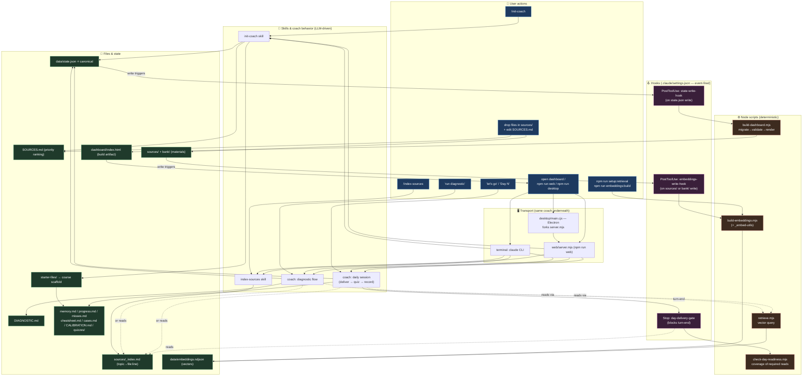

# Architecture Map — UX to Components

High-level map of how user actions flow through skills, node scripts, hooks, and files.
Behind-the-scenes at a module/concept level, not line-level.

## How to read it

- **Blue = what the user does.** Everything starts here.
- **Green = files** (the real source of truth; `state.json` ⭐ is canonical).
- **Brown = node scripts** (deterministic — no LLM; pure compute).
- **Purple = hooks** (fire automatically on file writes / turn-end; the "enforcement" layer).
- **Skills & coach = LLM-driven** (judgment, teaching, writing files).

## Three things the diagram makes visible

1. **The LLM only writes raw inputs; scripts compute the numbers.** Coach writes `state.json`; a hook fires `build-dashboard.mjs` to recompute readiness + render HTML. Coach never hand-builds the dashboard.
2. **Rules are enforced mechanically, not trusted.** The `Stop` hook (`day-delivery-gate`) refuses to end a turn until `check-day-readiness` confirms the required sources were actually read.
3. **Transport is swappable, coach is the same.** Terminal, web, and desktop all drive the identical skills/scripts/hooks/files underneath — Electron just forks the web server.
