# Architecture Map — UX to Components

High-level map of how student actions flow through transports, the Electron
wrapper, skills/coach, node scripts, hooks, and files. Module/concept level, not
line-level. Rendered artifacts: `architecture-map.svg` (vector — use for slides)
and `architecture-map.png` (high-res raster). Source: `architecture-map.mmd`.



## How to read it

- **Blue = student**, and the three **front doors** (terminal / web / desktop).
- **Gold = Electron wrapper internals** (`desktop/main.cjs`).
- **Indigo = server + coach** — the LLM-driven turn and the Agent SDK that drives the bundled `claude` binary.
- **Brown = node scripts** (deterministic, no LLM).
- **Purple = hooks** (auto-fire on file writes / turn-end).
- **Green = files**, grouped by the three storage roots.
- **Amber = the dashboard** build artifact.

## Five things the diagram makes visible

1. **Three front doors, one coach.** Terminal, web, and desktop all reach the identical skills / scripts / hooks / files. The web and desktop paths run through `web/server.mjs`; Electron just forks that server and points a window at it.

2. **The desktop app bundles everything.** The Agent SDK ships Claude Code as a per-platform native binary, so the packaged `.app` carries its own `claude` — the student installs nothing and only needs a Claude account to sign in. No API key: sign-in rides the subscription login.

3. **Three storage roots keep data safe across updates** (`scripts/_roots.mjs`). Bundle is read-only (replaced wholesale on update); data is writable (`userData/workspace`, the student's work, never auto-touched); cache is disposable (regenerates). A repo checkout collapses all three onto the checkout, so running from source is unchanged.

4. **The LLM writes raw inputs; scripts compute the numbers.** The coach writes `state.json`; a hook fires `build-dashboard.mjs`, which recomputes readiness math + renders the HTML. The coach never hand-builds the dashboard.

5. **Rules are enforced mechanically, not trusted.** The `Stop` hook (`day-delivery-gate` → `check-day-readiness`) refuses to end a turn until the required sources were actually read. Retrieval mode picks *how* sources are found (vector / index / direct); this gate enforces *that they were read*.

## The mermaid source

The diagram lives in `architecture-map.mmd`. To re-render after an edit (uses
system Chrome, so no Chromium download — works behind a TLS-intercepting proxy):

```bash
export PUPPETEER_SKIP_DOWNLOAD=1
# puppeteer-config.json points executablePath at /Applications/Google Chrome.app
npx -y @mermaid-js/mermaid-cli -i docs/architecture-map.mmd -o docs/architecture-map.svg \
  -p /tmp/puppeteer-config.json -t dark -b '#0f1115'
```
